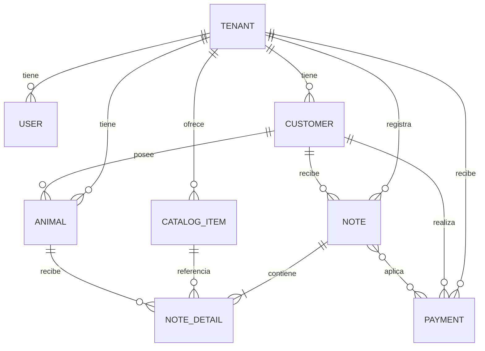

# Gorozpe V2 - Mapa vivo del sistema

> Documento de referencia para entender el sistema antes de disenar o implementar
> nuevos features. Debe actualizarse cuando cambien reglas de negocio, arquitectura,
> entidades, rutas importantes o flujos criticos.

**Ultima revision:** 2026-06-12

## 1. Proposito del producto

Gorozpe V2 es un SaaS multi-tenant para la operacion de clinicas veterinarias.
Permite administrar clientes, mascotas, expedientes clinicos, servicios, ventas,
pagos, facturacion y configuracion de cada clinica.

El sistema tiene tres superficies principales:

1. **Administracion SaaS:** gestion de tenants, planes, suscripciones y reportes.
2. **Portal web de la clinica:** operacion completa del tenant mediante Laravel y Blade.
3. **Aplicacion movil:** operacion diaria mediante Ionic/Angular y API REST.

## 2. Estructura del repositorio

```text
gorozpev2/
|-- vetsys/       Backend Laravel, portal web, API y base de datos
|-- gorozpeApp/   Aplicacion movil Ionic/Angular
|-- media/        Archivos auxiliares del workspace
|-- .dist/        Artefactos auxiliares
`-- SISTEMA.md    Este documento
```

### Tecnologias principales

| Area | Tecnologia |
|---|---|
| Backend y web | Laravel 10, PHP 8.1+, Blade |
| Autenticacion API | Laravel Sanctum |
| Roles y permisos | Spatie Laravel Permission |
| Aplicacion movil | Ionic 8, Angular 20, Capacitor |
| Pagos | Stripe y pagos manuales |
| Almacenamiento clinico | Filesystem Laravel, incluyendo soporte S3/R2 |
| PDFs | `barryvdh/laravel-dompdf` |

## 3. Arquitectura multi-tenant

La unidad central de aislamiento es `Tenant`.

La mayoria de las entidades operativas contienen `tenant_id`, incluyendo:

- usuarios;
- clientes;
- mascotas;
- tipos de mascota y campos dinamicos;
- servicios y productos;
- metodos de pago;
- notas, pagos y detalles;
- clubes y documentos clinicos;
- notificaciones;
- perfiles fiscales y facturas.

### Regla obligatoria de aislamiento

Toda consulta, validacion, actualizacion y eliminacion de informacion operativa debe
limitarse al tenant autenticado.

Patron esperado:

```php
$tenantId = $request->user()->tenant_id;

Model::where('tenant_id', $tenantId);
```

Las validaciones de llaves foraneas tambien deben limitarse al tenant:

```php
Rule::exists('customers', 'id')
    ->where(fn ($query) => $query->where('tenant_id', $tenantId));
```

No es suficiente comprobar que un registro existe. Tambien debe comprobarse que
pertenece al tenant actual.

### Estados del tenant que no deben confundirse

| Concepto | Campos / mecanismo | Significado |
|---|---|---|
| Activacion de cuenta | `activation_*`, `activated_at` | Alta inicial mediante codigo o enlace |
| Estado administrativo | `status`, `is_active` | Permite o bloquea la operacion |
| Acceso comercial | `plan_id`, prueba, suscripcion | Define vigencia y capacidades contratadas |
| Onboarding operativo | Pendiente de implementar | Mide adopcion y primeros resultados reales |

`activated_at` no debe reutilizarse para representar onboarding.

## 4. Acceso y autorizacion

### Portal web

Las rutas de clinica usan:

```text
auth
access.web
tenant.plan
check.tenant.subscription
```

Los administradores SaaS utilizan el rol `super-admin`.

### API movil

Las rutas protegidas usan:

```text
auth:sanctum
access.mobile
api.tenant
```

`EnsureApiTenantAccess` valida:

- usuario activo;
- que no sea `super-admin`;
- tenant asignado y activo;
- plan activo;
- vigencia de suscripcion o prueba.

Los accesos web y movil cuentan con sesiones de acceso independientes mediante
`UserAccessSession`.

## 5. Superficies del backend

### Rutas web

Archivo principal: `vetsys/routes/web.php`

Grupos relevantes:

- `/admin/*`: administracion SaaS.
- `/client/*`: portal de la clinica.
- `/activar-cuenta/*`: activacion inicial del tenant.
- `/invitation/*`: aceptacion de invitaciones de usuarios.
- `/pagar/*`: pago publico de una nota.
- `/pagar-cuenta/*`: pago publico de saldo de cliente.
- `/ticket/*`: ticket publico.
- `/stripe/webhook`: recepcion de eventos de Stripe.

### API movil

Archivo principal: `vetsys/routes/api.php`

Base URL:

```text
/api/v1
```

Recursos principales:

- `/auth/*`
- `/mobile/bootstrap`
- `/customers`
- `/animals`
- `/animal-types`
- `/catalog-items`
- `/notes`
- `/payments`
- `/payment-methods`
- `/notifications`
- `/sync/push`

### Bootstrap movil

`MobileBootstrapController` entrega:

- fecha del servidor;
- usuario y tenant;
- tipos de mascota y campos dinamicos;
- clubes;
- metodos de pago;
- servicios y productos;
- clientes;
- mascotas y valores dinamicos.

Admite sincronizacion incremental mediante el parametro `since`.

La app guarda el resultado y `server_time` en `localStorage`.

## 6. Aplicacion movil

Ubicacion: `gorozpeApp/src/app`

### Rutas principales

| Ruta | Funcion |
|---|---|
| `/login` | Inicio de sesion |
| `/tabs/home` | Dashboard |
| `/tabs/clientes` | Clientes |
| `/tabs/clientes/:id` | Detalle de cliente |
| `/tabs/mascotas` | Mascotas |
| `/tabs/mascotas/:id` | Expediente de mascota |
| `/tabs/servicios` | Servicios y productos |
| `/tabs/notas/nueva` | Crear nota |
| `/tabs/notas/:id` | Detalle y cobro de nota |
| `/tabs/pagos` | Notas y pagos |

### Servicios base

- `ApiService`: peticiones HTTP con token Bearer.
- `SessionStorageService`: token, usuario, bootstrap y ultima sincronizacion.
- `BootstrapService`: carga inicial e incremental.
- `authGuard`: protege rutas autenticadas.

### Consideraciones moviles

- La aplicacion movil consume la API como fuente de verdad.
- Clientes, mascotas, notas y pagos soportan identificadores de cliente para
  sincronizacion o idempotencia.
- Despues de modificar datos que afectan catalogos o estado global, debe evaluarse
  si tambien debe refrescarse el bootstrap local.
- La app actualmente consulta tipos de mascota y metodos de pago, pero no ofrece
  una pantalla movil completa para configurarlos.

## 7. Modelo de dominio

### Nucleo comercial



### Entidades principales

| Entidad | Responsabilidad |
|---|---|
| `Tenant` | Clinica y raiz de aislamiento |
| `User` | Usuario perteneciente a un tenant o super-admin |
| `Customer` | Cliente o propietario |
| `Animal` | Mascota asignada a un cliente |
| `AnimalType` | Especie o tipo configurable |
| `AnimalTypeField` | Campo dinamico por tipo de mascota |
| `CatalogItem` | Servicio o producto |
| `PriceHistory` | Precio vigente e historial |
| `Inventory` | Existencia de productos |
| `Note` | Nota de venta |
| `NoteDetail` | Servicio/producto aplicado a una mascota |
| `Payment` | Dinero recibido de un cliente |
| `NotePayment` | Aplicacion parcial o total de un pago a una nota |
| `PaymentMethod` | Metodo de pago del tenant |

### Modulos clinicos adicionales

- clubes;
- Coggins;
- cartas de vacunacion;
- videos clinicos;
- estudios e imagenes de radiologia;
- comparticion de expedientes para telemedicina.

### Modulos administrativos adicionales

- planes y suscripciones;
- cobros del SaaS al tenant;
- Stripe Connect;
- configuracion fiscal;
- facturas;
- estados de cuenta;
- notificaciones para tenant y administradores.

## 8. Flujo principal de operacion

```text
Configurar clinica
  -> crear servicios/productos
  -> registrar cliente
  -> registrar mascota
  -> crear nota con mascota e items
  -> consumir inventario cuando corresponda
  -> registrar o recibir pago
  -> aplicar pago a una o varias notas
  -> marcar nota como PAGADA al liquidar saldo
  -> facturar si corresponde
```

### Reglas de notas

- Una nota pertenece a un tenant y cliente.
- Debe contener al menos una mascota y un item.
- El folio es unico dentro del tenant.
- Estados actuales: `PENDIENTE`, `PAGADA`, `CANCELADA`.
- El saldo se calcula como `total - pagos aplicados`.
- Los pagos pueden ser parciales.

### Reglas de pagos

- Un pago pertenece a tenant, cliente y metodo de pago.
- Un pago puede aplicarse a varias notas mediante `note_payments`.
- `amount_applied` representa cuanto del pago se asigno a una nota.
- Existen pagos manuales y pagos procesados mediante Stripe.
- Los webhooks y servicios de pago pueden cambiar una nota a `PAGADA`.

### Riesgo conocido

Una nota de total cero puede resultar `PAGADA` al crearse porque la condicion actual
compara `amountReceived >= total`. Los features que requieran comprobar un primer
cobro real deben exigir:

- nota con `total > 0`;
- pago aplicado con `amount_applied > 0`;
- preferentemente pago con estado `paid`.

## 9. Archivos clave

### Backend

| Tema | Archivo o directorio |
|---|---|
| Rutas web | `vetsys/routes/web.php` |
| Rutas API | `vetsys/routes/api.php` |
| Modelos | `vetsys/app/Models` |
| Controladores web de clinica | `vetsys/app/Http/Controllers/Client` |
| Controladores API | `vetsys/app/Http/Controllers/Api/V1` |
| Servicios de dominio | `vetsys/app/Services` |
| Middleware | `vetsys/app/Http/Middleware` |
| Migraciones | `vetsys/database/migrations` |
| Bootstrap movil | `vetsys/app/Http/Controllers/Api/V1/MobileBootstrapController.php` |
| Pagos Stripe | `vetsys/app/Http/Controllers/StripeWebhookController.php` |

### Aplicacion movil

| Tema | Archivo o directorio |
|---|---|
| Rutas principales | `gorozpeApp/src/app/app.routes.ts` |
| Rutas de tabs | `gorozpeApp/src/app/tabs/tabs.routes.ts` |
| Dashboard | `gorozpeApp/src/app/tab1` |
| Features | `gorozpeApp/src/app/features` |
| Servicios base | `gorozpeApp/src/app/core/services` |
| Modelos API | `gorozpeApp/src/app/core/models/api.models.ts` |

## 10. Convenciones para nuevos features

Antes de implementar un feature, responder:

1. Es global, de administracion SaaS o pertenece a un tenant?
2. Que roles y superficies pueden utilizarlo: web, movil, API publica?
3. Que entidad es la fuente de verdad?
4. Que estados y transiciones introduce?
5. Que consultas y validaciones requieren `tenant_id`?
6. Afecta plan, suscripcion o capacidades contratadas?
7. Debe soportar soft delete?
8. Debe soportar sincronizacion movil e idempotencia?
9. Debe producir notificaciones, archivos, pagos o auditoria?
10. Que pruebas evitan filtraciones entre tenants y regresiones del flujo principal?

### Checklist tecnico obligatorio

- [ ] Migracion reversible.
- [ ] Modelo y relaciones.
- [ ] `fillable`, casts y soft deletes revisados.
- [ ] Consultas limitadas por tenant.
- [ ] Validaciones `exists` y `unique` limitadas por tenant.
- [ ] Autorizacion para rutas web y API.
- [ ] Respuesta API estable y tipada en Angular.
- [ ] Estados vacios, carga y errores en interfaz.
- [ ] Compatibilidad con bootstrap/sincronizacion evaluada.
- [ ] Pruebas del caso feliz, permisos y aislamiento multi-tenant.
- [ ] `SISTEMA.md` actualizado si cambia arquitectura o reglas de negocio.

### Plantilla para documentar un feature

```md
## Feature: Nombre

Estado: propuesta | en desarrollo | activo

### Objetivo

### Fuente de verdad

### Reglas de negocio

### Estados y transiciones

### Backend

### Web

### Movil

### Seguridad multi-tenant

### Pruebas

### Decisiones y pendientes
```

## 11. Ruta guiada hacia la primera venta

**Estado:** en desarrollo; persistencia base implementada

### Objetivo

Medir y guiar a cada clinica por el camino minimo necesario para registrar su
primera venta. No reemplaza la activacion de cuenta ni bloquea el acceso general.

### Pasos propuestos

| Clave | Condicion |
|---|---|
| `first_animal_type_created` | Existe al menos un tipo de mascota activo |
| `first_payment_method_created` | Existe al menos un metodo de pago activo |
| `first_service_created` | Existe un `catalog_item` activo con `type = service` |
| `first_customer_created` | Existe al menos un cliente activo |
| `first_pet_created` | Existe una mascota activa asignada a un cliente del tenant |
| `first_note_created` | Existe una nota no cancelada, con detalles y total mayor a cero |

### Diseno recomendado

- Fuente de verdad: datos operativos existentes.
- Persistencia historica: tabla `tenant_onboarding_steps` implementada con
  `completed_at` y referencia polimorfica opcional a la evidencia.
- Servicio central: `TenantOnboardingService`.
- Entrega movil: incluir estado agregado en `/mobile/bootstrap`.
- Interfaz: tarjeta en dashboard mientras el onboarding este incompleto.
- Comportamiento: una vez completado un paso, no retrocede por eliminar o desactivar
  la primera evidencia.

### Avance implementado

- migracion `create_tenant_onboarding_steps_table`;
- modelo `TenantOnboardingStep` con los seis pasos soportados;
- relacion `Tenant::onboardingSteps()`;
- unicidad de cada paso por tenant;
- borrado en cascada al eliminar el tenant;
- `TenantOnboardingService` para reconciliar datos reales, registrar pasos de forma
  idempotente y calcular progreso;
- integracion web no bloqueante despues de crear o reactivar tipos de animal, metodos
  de pago, servicios, clientes y mascotas, y despues de crear notas;
- tarjeta de onboarding en el dashboard web con progreso, checklist, siguiente paso
  destacado y enlaces a cada accion;
- tours contextuales independientes y repetibles para cada pantalla de la ruta;
- estado compacto de finalizacion cuando la clinica completa los seis pasos;
- pruebas de modelo, persistencia y reglas de deteccion.

Pendiente para la fase web:

- pruebas del flujo web.

### Interfaz web implementada

El dashboard web ejecuta una reconciliacion segura al cargar y recibe el estado
presentado desde `Client\DashboardController`.

Comportamiento:

- mientras falten pasos, muestra una tarjeta de ruta hacia la primera venta;
- presenta cantidad completada, porcentaje y barra de progreso;
- muestra los seis pasos en el orden operativo definido;
- destaca el siguiente paso recomendado;
- cada paso pendiente enlaza a la pantalla web correspondiente;
- al completar los seis pasos, reemplaza el checklist por un estado compacto 6/6;
- si la reconciliacion falla, el dashboard continua funcionando y omite la tarjeta.

Rutas utilizadas por la tarjeta:

| Paso | Ruta web |
|---|---|
| Crear tipo de animal | `client.mi-configuracion.index` |
| Crear metodo de pago | `client.mi-configuracion.index?tab=pagos` |
| Crear servicio | `client.servicios.index` |
| Crear cliente | `client.customers.index` |
| Crear mascota | `client.animals.index` |
| Crear primera venta | `client.ventas.create` |

### Dependencia pendiente

La app movil necesita una ruta y pantalla para configurar tipos de mascota y metodos
de pago si se pretende completar todo el onboarding sin utilizar el portal web.

## 12. Trabajos futuros y roadmap

Esta seccion concentra features planeados o en proceso mencionados en la
documentacion del proyecto. Antes de implementarlos debe definirse alcance,
prioridad, responsable y criterio de finalizacion.

### Resumen

| Trabajo futuro | Estado conocido | Objetivo principal |
|---|---|---|
| Onboarding operativo de clinica | En desarrollo | Guiar y medir el primer ciclo de valor del tenant |
| Integracion completa con FacturaApi | En proceso | Emitir y administrar facturacion fiscal |
| Recordatorios y links por WhatsApp | Planeado | Automatizar cobranza y comunicacion con clientes |
| App movil para duenos de mascotas | Planeada | Dar acceso al usuario final a informacion y acciones |
| Configuracion completa desde app movil | Pendiente | Permitir operar sin depender del portal web |

### Onboarding operativo de clinica

Implementar el feature descrito en la seccion anterior:

- persistir pasos completados y evidencia;
- entregar el estado mediante API y bootstrap movil;
- mostrar checklist y siguiente accion en dashboards;
- agregar metricas de conversion y tiempo entre pasos;
- permitir completar configuracion inicial desde movil.

### Integracion completa con FacturaApi

**Estado:** en proceso, alcance por confirmar.

Trabajos esperados:

- definir FacturaApi como proveedor fiscal y encapsularlo en un servicio;
- emitir facturas exclusivamente desde notas elegibles y pagadas;
- almacenar identificadores, XML, PDF, estatus y respuestas del proveedor;
- soportar cancelacion, reintentos e idempotencia;
- validar perfiles fiscales del tenant y cliente antes de timbrar;
- manejar errores del proveedor sin duplicar facturas;
- limitar toda consulta y operacion fiscal por tenant;
- agregar pruebas de errores, reintentos y respuestas incompletas.

### Recordatorios y links de pago por WhatsApp

**Estado:** planeado; proveedor y reglas de envio por definir.

Trabajos esperados:

- generar mensajes para notas pendientes, saldos y estados de cuenta;
- reutilizar enlaces publicos de pago existentes;
- registrar consentimiento, telefono destino, fecha, estado y resultado del envio;
- evitar envios duplicados mediante idempotencia;
- definir horarios, frecuencia maxima y reglas de reintento;
- permitir plantillas configurables por tenant;
- registrar auditoria sin guardar secretos ni datos sensibles innecesarios;
- procesar envios asincronos para no bloquear solicitudes web.

### App movil para duenos de mascotas

**Estado:** planeada; producto y autenticacion por definir.

Alcance inicial sugerido:

- acceso separado del personal veterinario;
- consulta de mascotas asociadas al propietario;
- historial de servicios y documentos clinicos autorizados;
- cartas de vacunacion y recordatorios;
- consulta de notas, saldos y enlaces de pago;
- notificaciones de la clinica;
- controles explicitos sobre que informacion comparte cada tenant.

Decisiones requeridas:

- modelo de identidad del propietario y vinculacion con `Customer`;
- estrategia cuando un propietario aparece en varios tenants;
- API y permisos separados de la aplicacion del personal;
- politicas de privacidad, revocacion y recuperacion de acceso.

### Configuracion completa desde app movil

**Estado:** pendiente.

La app actualmente consume tipos de mascota y metodos de pago, pero no ofrece todas
las operaciones de configuracion disponibles en el portal web.

Trabajos esperados:

- crear y administrar tipos de mascota;
- crear y administrar metodos de pago;
- editar datos basicos de la clinica;
- evaluar configuracion de usuarios, permisos y Stripe Connect;
- refrescar bootstrap despues de cambios;
- aplicar permisos y capacidades contratadas por plan.

### Reglas para incorporar trabajos al roadmap

Cada trabajo futuro debe documentar antes de desarrollo:

- problema y resultado esperado;
- superficie objetivo: admin, web de clinica, movil de personal o movil de dueno;
- fuente de verdad y modelo de permisos;
- riesgos multi-tenant, privacidad y pagos;
- dependencias externas y estrategia ante fallos;
- eventos o metricas que demostraran adopcion;
- fases de entrega y criterio para marcarlo como activo.

## 13. Deuda y puntos de atencion conocidos

- Existe logica duplicada entre controladores web y API para notas, pagos y otros
  recursos. Un cambio de reglas debe revisarse en ambas superficies.
- La activacion automatica de suscripciones programadas esta duplicada en middleware.
- `Tenant` concentra muchas relaciones y presenta formato inconsistente; evitar
  ampliar esa inconsistencia al tocarlo.
- El dashboard movil realiza varias consultas separadas para estadisticas operativas.
  Los nuevos resumenes globales deberian considerar un endpoint agregado.
- Parte del codigo contiene texto con problemas de codificacion. Mantener nuevos
  archivos en UTF-8 y evitar introducir mas texto corrupto.
- No asumir que `status = PAGADA` demuestra por si solo que existio un cobro real.

## 14. Como mantener este documento

Actualizar este archivo cuando ocurra cualquiera de estos cambios:

- se agrega un modulo o entidad importante;
- cambia una regla de tenant, pago, nota, sincronizacion o acceso;
- aparece una nueva superficie o integracion;
- se introduce una decision arquitectonica;
- se descubre deuda tecnica que pueda afectar futuros features;
- un feature propuesto se implementa o cambia de alcance.

Registrar solo informacion estable y decisiones utiles. Los detalles temporales de
implementacion deben vivir en issues, PRs o documentos especificos del feature.
